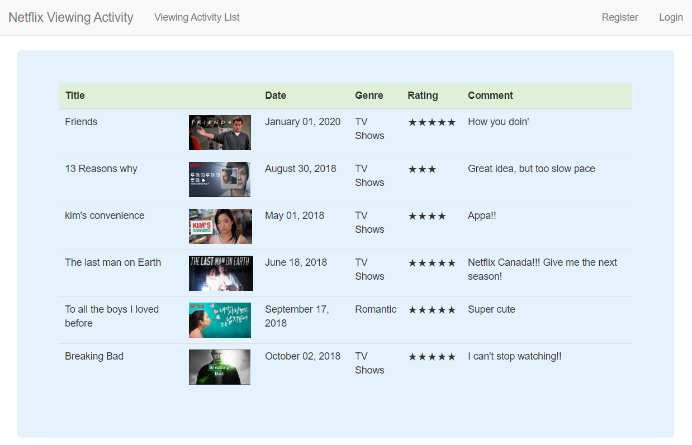

## Netflix Viewing Activity

### Description
Live Page: <a href="https://fierce-stream-56200.herokuapp.com/default.php" target="_blank"> https://fierce-stream-56200.herokuapp.com/default.php </a> 
 

 
This website is for recording their own Netflix viewing activity. A user can input the title, date, genre, rating, and comment.
 
The date cannot be the future than now, and only a valid date is accepted (i.e. February 31 is not allowed).
 

### Skills
It uses PHP, MySQL, Twitter Bootstrap, and Python and is deployed to Heroku (2020).